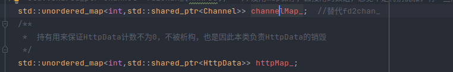

说明：测试并发使用webbench工具，测试情况并不严谨，没有保证没有其他程序，以及webbench和服务器都在一台机器上等等，只是一个感性的测试。

## 初始测试情况

目前对`webserver`项目的优化只有：将`epoll`保存的所有对应文件描述符上面的channel和httpData又数组变成了`unordered_map`，由数组保存的话原来最大支持多少个连接初始申请的数组就有多长，占用内存很大，现在使用`unordered_map`来保存了。

> 严格来说应该从数组开始测试的，但是懒得改回去了，而且`unordered_map`的时间复杂度也是O(1)，懒了。

具体见下：



测试结果：

启动命令：

`webserver`

```
(base) ➜  out_bin git:(main) ✗ ./WebServer -t 5 -p 9001 -l /home/swx/2023_project/WebServer/log.txt
```

```bash
(base) ➜  WebBench git:(main) ✗ ./webbench -c 1000 -t 60 http://127.0.0.1:9001/\
> 
Webbench - Simple Web Benchmark 1.5
Copyright (c) Radim Kolar 1997-2004, GPL Open Source Software.

Request:
GET / HTTP/1.0
User-Agent: WebBench 1.5
Host: 127.0.0.1


Runing info: 1000 clients, running 60 sec.


Speed=2000242 pages/min, 7934293 bytes/sec.
Requests: 2000242 susceed, 0 failed.
```

## 使用make_share代替new

使用new xxx来创建共享指针的话，会分配两次内存，效率比较低。

优先使用`make_share`


> 注意make_share不只是有优点，也有一定的缺点。
> 
> 优点：内存分配只有一次，因此效率更高。 异常安全(目前不懂)。
> 
> 缺点：构造函数是**私有的时候，无法使用**（可解决，其中一个方法就是利用继承，见[链接](https://stackoverflow.com/questions/8147027/how-do-i-call-stdmake-shared-on-a-class-with-only-protected-or-private-const?spm=a2c6h.12873639.article-detail.6.2d9e1ccaQC01Wa&rq=1)；**对象的内存可能无法及时回收**。
> 
> 感觉还有点不太明白，还需要学习：[C++11使用make_shared的优势和劣势-阿里云开发者社区](https://developer.aliyun.com/article/321323)
> 
> 此外注意：**如果不开O2优化，那么`make_shared`的速度往往还比直接new慢一些**，见[链接](Tech-Foo: Experimenting with C++ std::make_shared](http://tech-foo.blogspot.com/2012/04/experimenting-with-c-stdmakeshared.html?spm=a2c6h.12873639.article-detail.5.2d9e1ccaQC01Wa)

```
Runing info: 1000 clients, running 60 sec.

Speed=2064273 pages/min, 8188282 bytes/sec.
Requests: 2064273 susceed, 0 failed.
```

> 悄悄的说，好像在某些测试的时候甚至会略低于原来的。

## 内存池

内存池如何设计，其优势在哪里这里就不重复展开了，目前加在项目中的还是比较简单的版本，即 定长 + 不支持并发 的版本。

> todo：后面完成一个文档，分析下 上面不展开的 内存池如何设计、其优势在哪里。

这里主要讲解的是如何在项目中用上这个线程池。

内存池说白了也就是一个内存分配器，那么涉及内存分配的地方自然就可以用到，自己内存分配的主要就是heap区（当然也可以在栈区，不过也不会有人这么用吧，见[链接](https://cloud.tencent.com/developer/article/1177460)）了，也就是`new`。

其次主要有两种地方可能会使用，一种是STL容器，一种是自己的类。

### STL容器|allocator

STL容器要使用自己设计的内存池还是比较简单的，只需要一个操作，就是在初始化的使用将分配器选择自己实现的内存池（分配器）即可，为了可以使用，自己实现的内存池（分配器）必须满足对外的接口，主要包括下面五个接口：

```c++
pointer allocate(size_type n = 1, const_pointer hint = 0);
void deallocate(pointer p, size_type n = 1);
// 基于内存池的元素构造和析构
void construct(pointer p, const_reference val);
void destroy(pointer p);
template <typename U> struct rebind {
      typedef MemoryPool<U> other;
};
```

，STL使用内存池的范例：

### 自定义的类|内存池

而自己的类要使用内存池稍微麻烦一点，理解之前需要明白：new operator、operator new()和placement new()的区别与联系。

简单理解，在堆区创造一个对象可以分成：

1. 申请空间

2. 在申请的空间上构造需要的对象

那么new operator可以分成`operator new()`（用来申请空间）和placement new()（用来在申请的空间上构造对象）。

那么我们可以想一想使用内存池之后哪一步变了，其实只有`operator new()`（用来申请空间）这一步变了，因此如果是自己设计的类想使用内存池，想办法让内存池拿出空间即可，具体可见内存池的allocate()方法。

具体内存池的设计以及代码可见：https://github.com/578223592/memory_pool_below_websever
