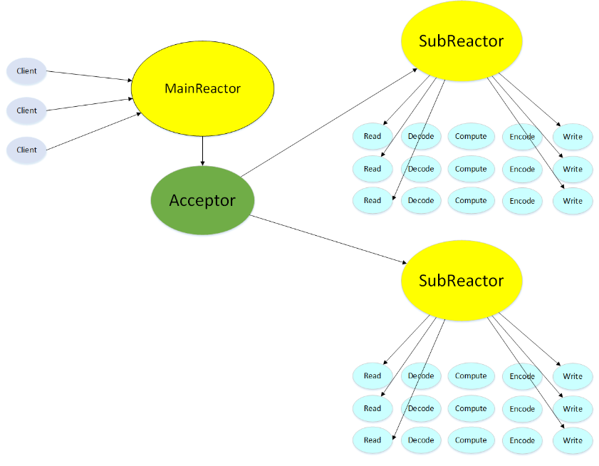

# A C++ High Performance Web Server

## Introduction

本项目为C++11编写的Web服务器，解析了get、head请求，可处理静态资源，支持HTTP长连接，支持管线化请求，并实现了异步日志，记录服务器运行状态。  

| Part Ⅰ                 | Part Ⅱ                   | Part Ⅲ                 | Part Ⅳ                   | Part Ⅴ                 |
|:----------------------:|:------------------------:|:----------------------:|:------------------------:|:----------------------:|
| [并发模型](./Docs/并发模型.md) | [连接的维护](./Docs/连接的维护.md) | [版本历史](./Docs/版本历史.md) | [测试及改进](./Docs/测试及改进.md) | [项目目的](./Docs/项目目的.md) |

## Envoirment

* OS: Ubuntu 22.04.2 LTS
* Complier: g++ (Ubuntu 11.4.0-1ubuntu1~22.04) 11.4.0

## Build

    #位于项目目录
    cd cmake-build-debug  ##如果没有该文件夹，自行创建即可
    rm -rf *
    cmake ..
    make
    #可执行文件在项目目录/out_bin目录下

## Usage

    ./WebServer [-t thread_numbers] [-p port] [-l log_file_path(should begin with '/')]

## Technical points

- [x] 使用Epoll边沿触发的IO多路复用技术，非阻塞IO，使用Reactor模式

- [ ] 使用多线程充分利用多核CPU，并使用线程池避免线程频繁创建销毁的开销

- [ ] 使用基于小根堆的定时器关闭超时请求

- [ ] 主从Reactor响应模型：主线程只负责accept请求，并以Round Robin的方式分发给其它IO线程(兼计算线程)，锁的争用只会出现在主线程和某一特定线程中

- [ ] 使用eventfd实现了线程的异步唤醒

- [ ] 使用双缓冲区技术实现了简单的异步日志系统

- [ ] 为减少内存泄漏的可能，使用智能指针等RAII机制

- [ ] 使用状态机解析了HTTP请求,支持管线化

- [ ] 支持优雅关闭连接

- [ ] 加入内存池减少系统调用

- [ ] 支持简单发送文件的功能，方便涉及到 零拷贝 的知识

- [ ] 对大文件发送进行分片的操作
* ## Model

并发模型为Reactor+非阻塞IO+线程池，新连接Round Robin分配，详细介绍请参考[并发模型](./Docs/并发模型.md)

## Others

除了项目基本的代码，进服务器进行压测时，对开源测试工具Webbench增加了Keep-Alive选项和测试功能: 改写后的[Webbench](https://github.com/578223592/my-tiny-web-server/WebBench)
